# Nymo

Веб-месенджер (PWA) на vanilla JavaScript: чати, медіа, профіль, магазин, міні-ігри, гаманець. Збірка — [Vite](https://vite.dev/), без React/Vue.

## Швидкий старт

```bash
npm install
npm run dev
```

- Головна сторінка (після входу): [http://localhost:5173](http://localhost:5173)
- Авторизація: [http://localhost:5173/auth/](http://localhost:5173/auth/)

У dev service worker **вимкнений** за замовчуванням. Щоб увімкнути локально: `VITE_ENABLE_SW=true npm run dev`.

## Скрипти

| Команда | Опис |
|---------|------|
| `npm run dev` | Dev-сервер Vite (порт `5173`) |
| `npm run build` | Production-збірка в `dist/` |
| `npm run preview` | Перегляд зібраного `dist/` |
| `npm run pwa:icons` | Генерація PWA-іконок (`scripts/generate-pwa-icons.mjs`) |

## Змінні середовища

Скопіюй `.env.production.example` → `.env.production` для локального `npm run build`:

| Змінна | Опис |
|--------|------|
| `VITE_BASE_PATH` | Base URL на GitHub Pages (за замовчуванням `/Nymo/`) |
| `VITE_API_BASE_URL` | Backend API (за замовчуванням Render URL з прикладу) |
| `VITE_ENABLE_SW` | `true` / `false` — service worker (у dev за замовчуванням вимкнений) |

Для HMR через тунель/проксі: `VITE_HMR_HOST`, `VITE_HMR_PROTOCOL`, `VITE_HMR_PORT`, `VITE_HMR_CLIENT_PORT`.

## Деплой

- **GitHub Pages (Actions artifact):** push у `main` → workflow [`.github/workflows/deploy-pages.yml`](.github/workflows/deploy-pages.yml)
- **Гілка `gh-pages`:** вручну → [`.github/workflows/deploy-gh-pages-branch.yml`](.github/workflows/deploy-gh-pages-branch.yml)

Обидва збирають з `VITE_BASE_PATH=/Nymo/` та `VITE_API_BASE_URL` з repository variable (або fallback з workflow).

## Структура репозиторію

```
Nymo/
├── index.html              # Точка входу чату: div#app + bootstrap
├── auth/index.html         # Сторінка входу / реєстрації
├── public/                 # Статика без збірки: sw.js, manifest, pwa/*
├── src/
│   ├── scripts/            # Логіка додатка → ARCHITECTURE.md
│   └── styles/             # CSS-шари → ARCHITECTURE.md
├── vite.config.js
└── package.json
```

## Де що верстається

| Що | Файл |
|----|------|
| Оболонка `index.html` | Тільки `<div id="app">` |
| UI месенджера (layout, модалки, sidebar) | [`src/scripts/ui/init/mount-app-shell.js`](src/scripts/ui/init/mount-app-shell.js) |
| Сторінка auth | [`auth/index.html`](auth/index.html) |
| Секції налаштувань / профілю / магазину | [`src/scripts/ui/templates/settings-templates.js`](src/scripts/ui/templates/settings-templates.js) |
| Списки чатів, повідомлення, динамічні блоки | `innerHTML` у `src/scripts/app/mixins/*` |
| Стилі | [`src/styles/main.css`](src/styles/main.css), [`src/styles/auth-main.css`](src/styles/auth-main.css) |

## Архітектура (детальніше)

- [Архітектура JavaScript](src/scripts/ARCHITECTURE.md) — entrypoints, `ChatApp`, mixins, shared
- [Архітектура стилів](src/styles/ARCHITECTURE.md) — шари CSS, import order, куди додавати правила

## Потік запуску

```mermaid
flowchart TD
  A[index.html або auth/index.html] --> B{bootstrap / auth-page}
  B -->|сесія є| C[mountAppShell]
  B -->|немає сесії| D[redirect /auth/]
  C --> E[new ChatApp]
  E --> F[mixins: messaging, interaction, features...]
  B --> G[register service worker на load]
```



1. **`bootstrap.js`** — перевірка сесії, PWA/service worker, мережеві банери, `mountAppShell()`, `window.app = new ChatApp()`.
2. **`auth/auth-page.js`** — wizard логіну/реєстрації, збереження сесії в `localStorage`.
3. **`ChatApp`** — стан + поведінка з mixin-класів (`core`, `interaction`, `messaging`, `features`, …).

## PWA і офлайн

- Service worker: [`public/sw.js`](public/sw.js) — кеш оболонки (`index.html`, assets, icons), клік по desktop-нотифікації.
- Чати в `localStorage` (`nymo_chats:<userId>`) — це не SW; SW лише допомагає **завантажити** застосунок без мережі.
- Показ нотифікацій — з основної сторінки через `registration.showNotification()`.

## Залежності

- **Runtime:** `three` (Nymo Drive / 3D), `qrcode`
- **CDN у HTML:** Socket.IO, Google Fonts
- **Dev:** Vite 7, sharp (іконки)

## Ліцензія

